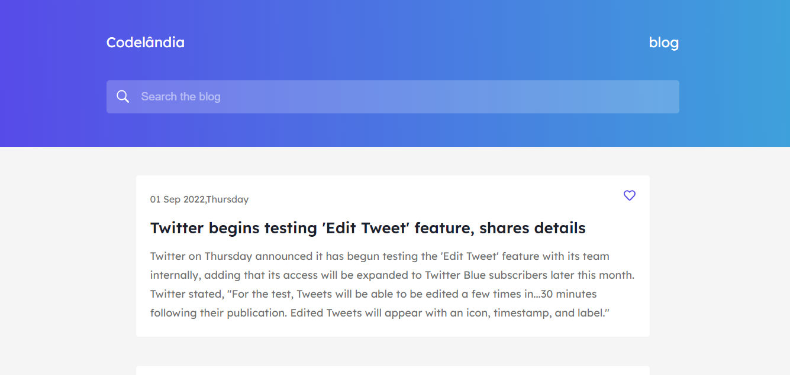

# blog

## desafio01-codelandia

#### Este é o desafio _01_ da comunidade _Codelândia_ por [iuricode](https://github.com/iuricode)!

<h4 align="center"><a href="https://desafio01-codelandia-self.vercel.app/">Clique para visitar o projeto</a></h4>

## 🎯 Objetivo

O desafio consiste em desenvolver landing page de acordo com o layout disponibilizado no [Figma](https://www.figma.com/file/Yb9IBH56g7T1hdIyZ3BMNO/Desafios---Codelândia?node-id=1148%3A2). Neste projeto também foi consumido uma [API de Noticias](https://github.com/cyberboysumanjay/Inshorts-News-API).

## 🛠️ Tecnologias utilizadas

Para o desenvolvimento deste site utilizei as seguintes tecnologias:

- React JS;
- Styled Components;
- Axios;
- React Icons;

## 🚀 Como executar o projeto

1. Clone este repositório

`$ https://github.com/giovanaraphaelli/desafio01-codelandia.git`

2. Acesse a pasta do projeto no seu terminal/cmd

`$ cd desafio01-codelandia`

3. Abra a pasta do projeto no VS Code via terminal/cmd

`$ code .`

4. Instale as dependências

`$ yarn install`

5. Execute a aplicação em modo de desenvolvimento

`$ yarn dev`

